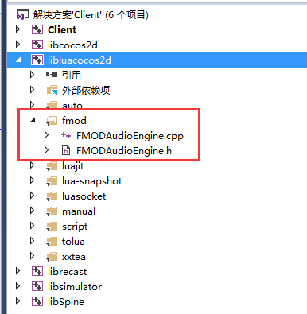
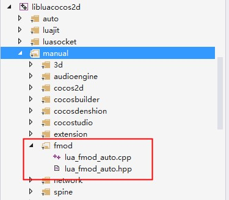
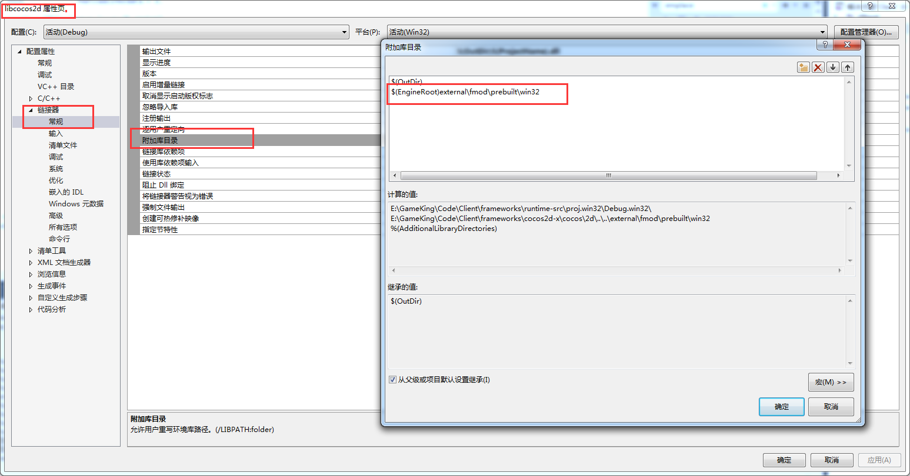
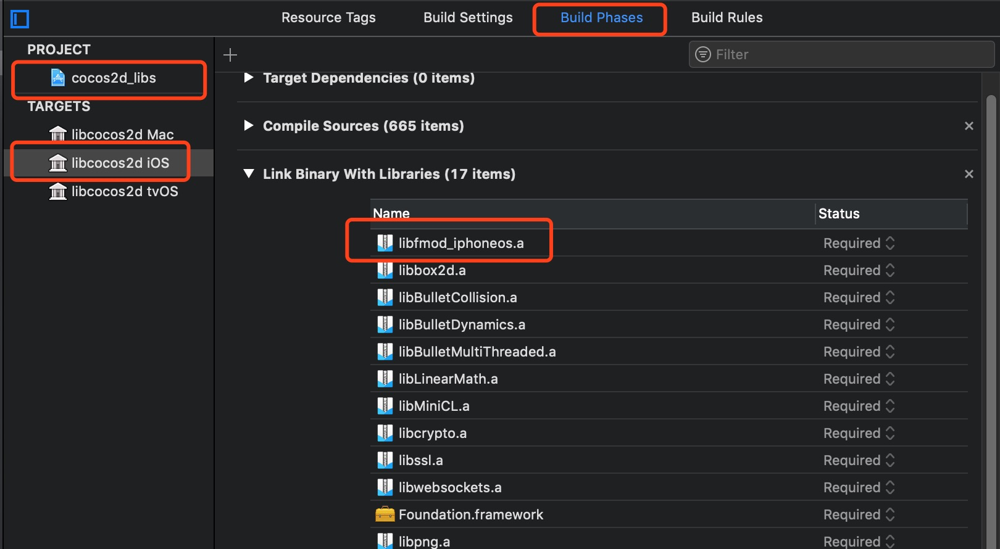
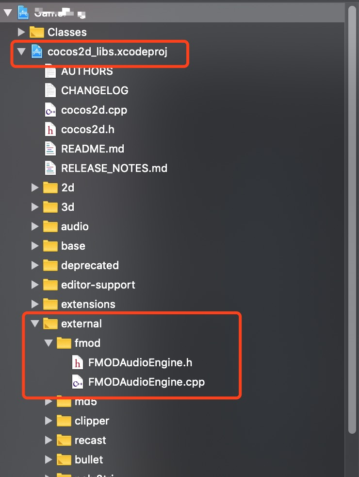
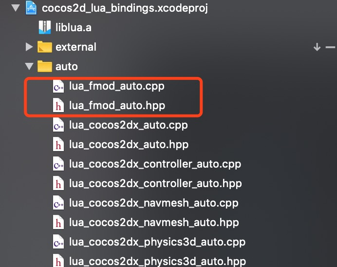

# FMOD集成指南

## 前提

[FMOD](https://www.fmod.com/)是为游戏开发者准备的音频引擎，比起Cocos2d-x内置的`SimpleAudioEngine`，其专业能力超出`SimpleAudioEngine`好几个量级。长期以来，我们内部使用的一直是`SimpleAudioEngine`，期间出现过音频无法播放、丢失等问题，为解决`SimpleAudioEngine`的硬伤，我们决定使用`FMOD`替换掉`SimpleAudioEngine`。这篇文章就旨在讲解`FMOD`集成的过程。

## 方案

本次集成基于开源方案[cocos2d-x-fmod](https://github.com/semgilo/cocos2d-x-fmod)，然而由于`cocos2d-x-fmod`集成的api过于简陋，没有发挥出`fmod`应有的强大，比如：设置音量缺失、不区分音乐和音效、不提供重播功能等，因此我在其基础上新增了很多API以适应项目的需要，并尽量向`SimpleAudioEngine`提供的API看齐。API的扩展在此处不是重点，下面重点说明集成的过程。

## 一、代码集成

1. 拉取[cocos2d-x-fmod](https://github.com/semgilo/cocos2d-x-fmod)
2. 将`fmod`目录复制到`frameworks⁩/cocos2d-x⁩/external`
3. 将`lua_fmod_auto.cpp`和`lua_fmod_auto.hpp`复制到`frameworks⁩/cocos2d-x⁩/cocos/scripting/lua-binding/manual` *(这里是一个坑，虽然它是auto，但实际上是manual，因此把它丢到manual下)*
4. 修改`frameworks/cocos2d-x/cocos/scripting/lua-bindings/manual/CCLuaStack.cpp`
	```cpp
	...
	#include "fmod/lua_fmod_auto.hpp"
	...
	// 2.register
	bool LuaStack::init(void)
	{
    	...
	    register_all_cocos2dx_fmod(_state);
    	...
    	return true;
	}
	```


## 二、Windows集成

1. 将`FMODAudioEngine.cpp`和`FMODAudioEngine.h`添加到`libcocos2d`工程
	

2. 将`lua_fmod_auto.cpp`和`lua_fmod_auto.hpp`添加到`libluacocos2d`工程
	

3. 配置fmod的附加库目录
	

4. 添加fmod的附加依赖项
	

5. 编译，成功后需要将`fmodL.dll`动态库复制到生成目录，否则程序会提示`fmodL.dll`而运行不起来


### 三、Android集成

1. 将`fmod.jar`复制到`app/libs`目录下，并修改`app/build.gradle`将其添加为库：
```gradle
// fmod
implementation files('libs\\fmod.jar')
```

2. 修改`AppActivity.java`
```java
	...
	static
	{
		//加载fmodL动态库
		System.loadLibrary("fmodL");
	}
	...
	protected void onCreate(Bundle savedInstanceState) {
	...
	// 初始化fmod
	org.fmod.FMOD.init(this);
	...
	}
	···
	protected void onDestroy() {
		···
		org.fmod.FMOD.close();
		···
		super.onDestroy();
	}
	···
```

3. 修改`cocos/Android.mk`:

	```plaintext
		···
		LOCAL_STATIC_LIBRARIES += fmod_static
		···
		$(call import-module,fmod/prebuilt/android)
	```

4. 修改`cocos/scripting/lua-bindings/proj.android/Android.mk`:

	```plaintext
		···
		LOCAL_SRC_FILES += ../manual/fmod/lua_fmod_auto.cpp

		LOCAL_C_INCLUDES := $(LOCAL_PATH)/../../../../external/lua/tolua \
		···
							$(LOCAL_PATH)/../manual/fmod \
							$(LOCAL_PATH)/../../../../external/fmod \
		···
		LOCAL_EXPORT_C_INCLUDES := $(LOCAL_PATH)/../../../../external/lua/tolua \
		···
							$(LOCAL_PATH)/../manual/fmod \
							$(LOCAL_PATH)/../../../../external/fmod \
		···
	```


### 四、iOS集成


#### Config libs



#### Config search path

```c++
1.cocos2d_libs.xcodeproj ▸ ⁨build setting ▸ ⁨User Header Search Paths
"$(SRCROOT)/../external/fmod/include/ios"

2.cocos2d_libs.xcodeproj ▸ ⁨build setting ▸ ⁨Library Search Paths
"$(SRCROOT)/../external/fmod/prebuilt/ios"
```

#### Add source file to XcodeProject 





## Lua接口

```lua
engine = fmod.FMODAudioengine:getInstance()

-- preload
engine:reload(path)
engine:preloadMusic()

-- volume
engine:setSoundVolume(1.0)
engine:setMusicVolume(1.0)
engine:getSoundVolume()
engine:getMusicVolume()

-- pitch
engine:setPitch(2.0)
engine:setMusicPitch(2.0)
engine:getPitch()
engime:getMusicPitch()

-- isMusicPlaying
engine:isMusicPlaying()

-- play
nSoundID = engine:playSound(path)
engine:playMusic(path, isLoop)

-- pause
engine:pauseSound(nSoundID)
engine:pauseMusic()
engine:pauseAllSounds(false)

-- stop
engine:stopSound(nSoundID)
engine:stopMusic()
engine:stopAllSounds(false)

-- resume
engine:resumeSound(nSoundID)
engine:resumeMusic()
engine:resumeAllSounds(true)

-- release
engine:releaseSound(path)
engine:releaseMusic()
engine:releaseAllSounds(false)

-- rewind
engine:rewindMusic()
```
